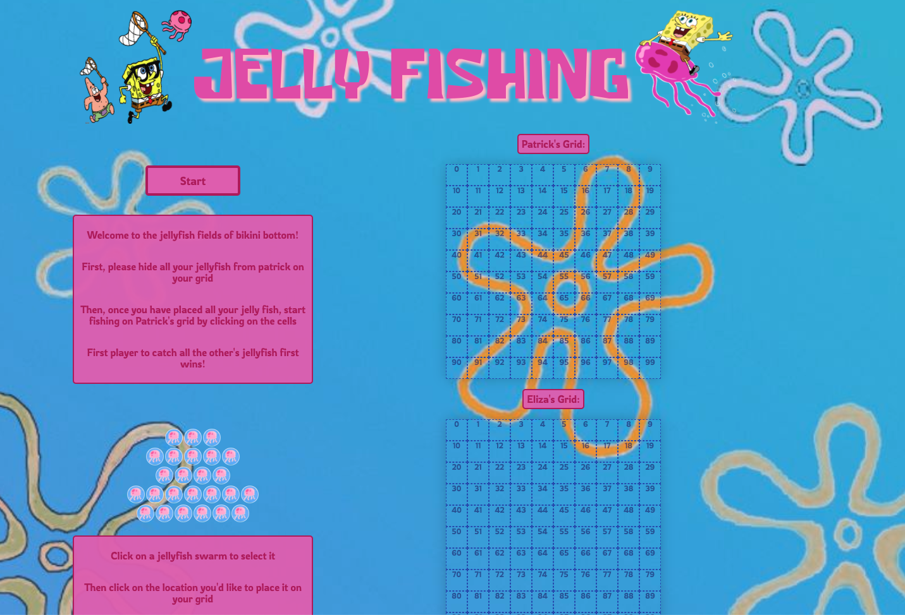
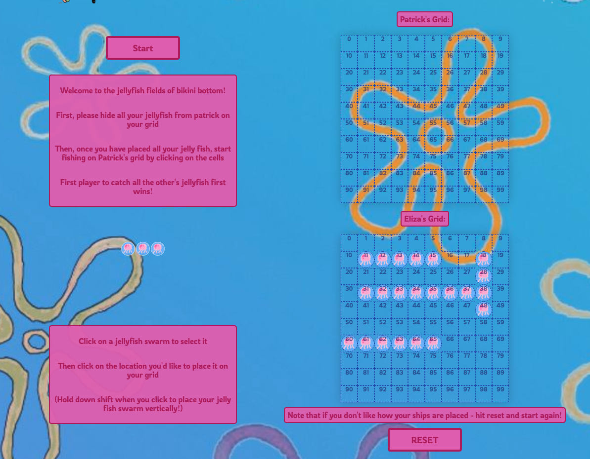
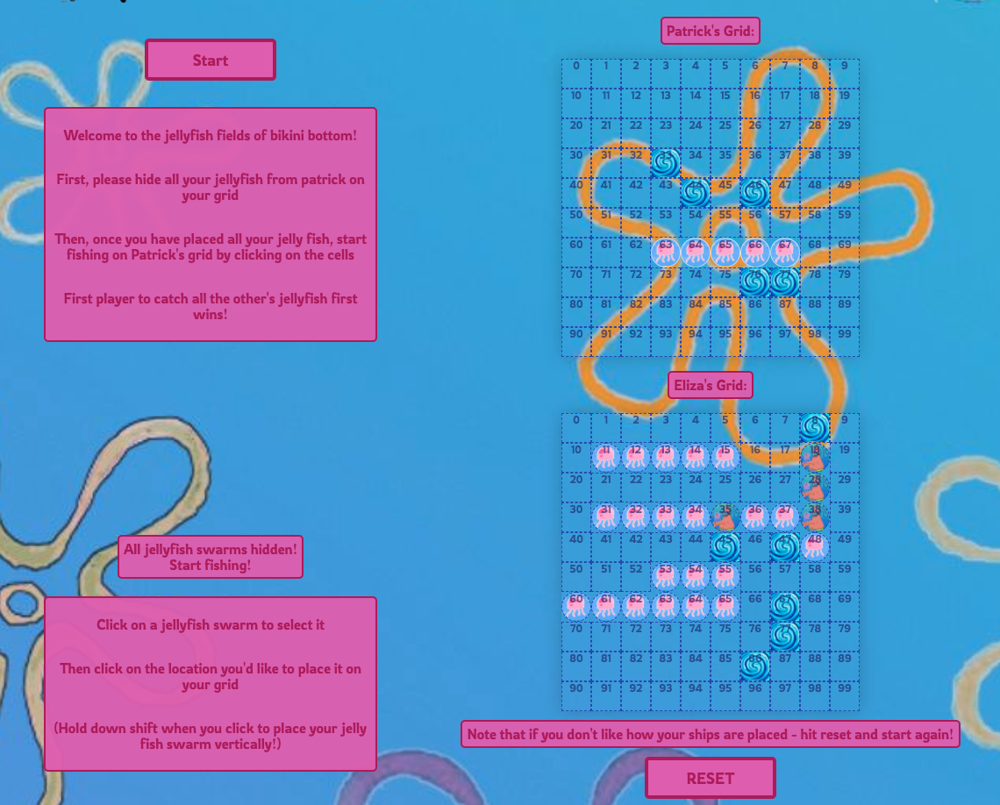
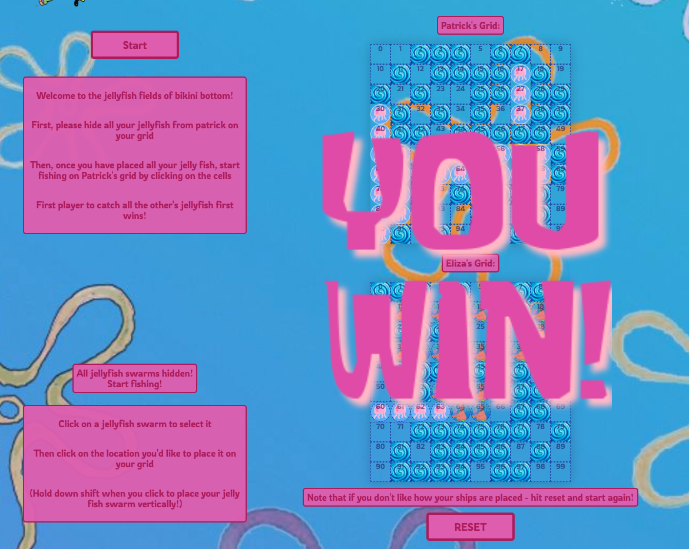

# sei-project-1
### Timeframe
7 days
Technologies used
•	JavaScript (ES6) + jQuery
•	HTML5 + HTML5 Audio
•	CSS 
•	GitHub
## Installation
1.	Clone or download the repo
2.	Open the index.html in your browser of choice

## My Game - BATTLESHIPS

You can find a hosted version here ----> https://elizathompson.github.io/sei-project-1/ 

## Game overview

This is my own SpongeBob themed recreation of the original battleships board game. The aim of the game is to sink all of the computer’s ships before it sinks yours!

## Game Instructions

1.	The game begins with two blanks grids and some instructions – the player clicks on the jellyfish and then on the grid where they would like to hide all their own jellyfish

2.	Once the player has hidden all their own jellyfish, they then click on the computer’s grid to search for the computer’s jellyfish 

3.	On every go, the player is notified whether they have found or missed the jellyfish on the computer’s grid. Then the computer will attack the player’s board.

4.	Depending on who finds all the other’s jellyfish first a win pop up appears notifying the player who has one and the option to replay.

## Process

The starting point for this game was creating a grid on which to build the rest of the game. I created the grid by using JavaScript to generate 2 grids each made up of 100 divs each. 
I then created the functionality for placing the player ships on their own grid, the hardest part here was allowing the player to choose whether they wanted to place the ship horizontally or vertically and checking for overlaps both horizontally and vertically.
The computers ships are not visible and are not actually ever rendered onto the grid, they are stored as an array of objects. Which I loop through when the player attacks to check for hits or misses.
Then I made the computer attack randomly at first but then attack close to where they last attacked if the last attack was a hit.  
### Challenges
One of the biggest challenges was allowing ships to be both vertical and horizontally placed both for the computer and the player and that the ships didn’t overflow out of the grid or onto the next line. 
### Future features
In the future, I would like to make the computer even smarter in its attacking to potentially make some different levels.
I would also like to make it so the player can drag and drop their ships onto the grid rather than clicking where they would like them to be.

